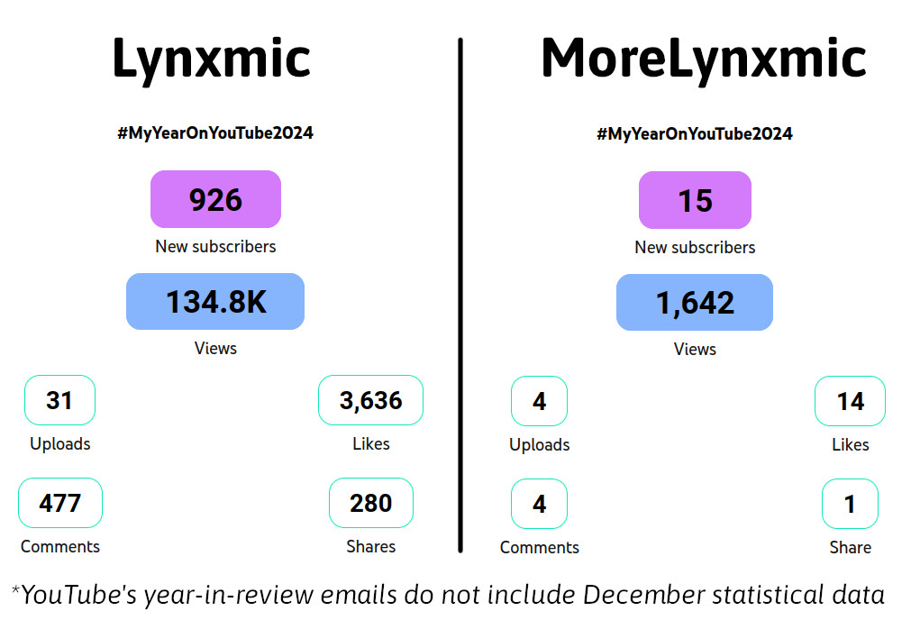
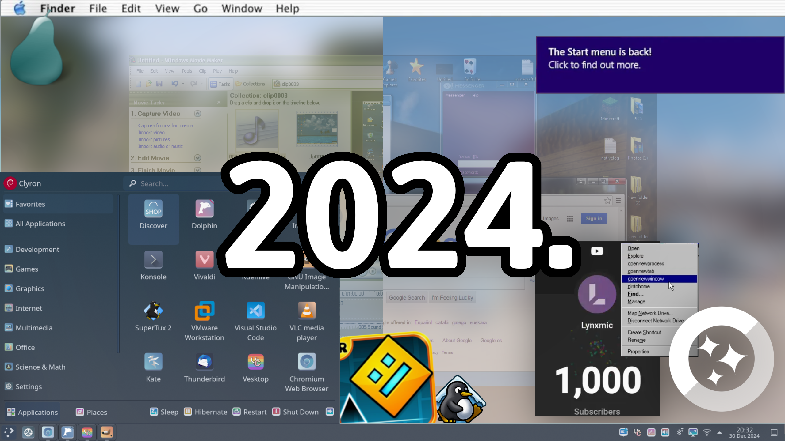

Woop, which date it is? 31 December? Well, it's time for another year wrap-up post! ^^ The tradition continues.

What's been poppin' in 2024? By far the biggest change this year was **me entirely changing my online alias from Lynxmic to Clyron**. Right now Lynxmic does still exist, but it now just means the tech-focused YouTube channel which, well, kept the name Lynxmic. The Lynxmic channel has seen its best year so far; as a TL;DR this year it joined the 1K+ subscriber club. This would not have been possible without y'all, but let's dive in even further.

## Let's talk Lynxmic
Now emerged as a complete separate project, **Lynxmic has seen its best year so far** - as already said previously. Everything has been at their peak, from the quality and quantity of the videos to the analytics side of things. What a glow up from the past!

Let's start with something basic: subscribers. 2024 started with the Lynxmic channel at a mere 430+ subscribers. Today the subscriber count is **deep into 1K subscribers**, in fact we're now almost literally halfway there to 2K! The sub count right now is above 1,390+. Just a few years ago, that would have been just a dream at most! The channel is finally on the map, that's all I have to say.

Even more than that, **quite many videos from this year have surpassed 1K views.** Some of them have even gone past 10K views: to list them, *[Swapping Windows 11's and Windows NT 4.0's Registries](https://www.youtube.com/watch?v=2CjnOp5vcJE)* (20K+ views, from Oct 2024), *[Recreating my First PC in a VM](https://www.youtube.com/watch?v=wkgMS8jm4nc)* (17K+ views, from Aug 2024), as well as *[There's a variant of Windows 8.1 with a Start Menu...](https://www.youtube.com/watch?v=lIyRVgt7Wws)* (14K+ views, Jul 2024). There's also a fourth video that's also closing up as well, namely *[Microsoft \*finally\* overhauled Windows Setup... ](https://www.youtube.com/watch?v=t5qvvHSPOvI) from Jan 2024, sitting at 9,8K views.

In total there have been **25 videos uploaded** on the Lynxmic channel this year. Definitely not a lot, but the waiting time between videos was definitely compensated with better productions. One major change was me finally letting go of both Camtasia and Vegas (the two video editors which I have been using since 2016, both ehhy) in favor of one single more professional video editing software, DaVinci Resolve

For the second channel, **MoreLynxmic**, 2024 was also a year of achievements. For the past 6 years the most popular video there used to be a GameCube menu video (currently at 730+ views). That video has been overtaken by the one video where I unsuccessfully attempted to get **Geometry Dash** (a game I notably started playing in 2024) **working on Windows 2000**, which also became the first MoreLynxmic video to reach 1K+ views. The channel is currently at 60+ subs after having started the year at around 35 subs, a rise of +25.

Closing this section with YouTube's 2024 year-in-review emails for both Lynxmic and MoreLynxmic channels.

## About the Clyron rebrand
Before I go any deeper into that, if you aren't aware yet of the major changes happening (and you're curious at all), I'd suggest reading the initial blog post announcing this rebrand ([here](https://clyron.is-a.dev/2024/07/23/a-new-era.html)) to get the most awareness. This separation of the brandings took effect during July 2024. I was initally Sunn/Sunnville, **later changed to Clyron in August** (which marked 5 years since the rebranding from solarixtech to Lynxmic), since Sunn/Sunnville didn't sound good at all imo

TL;DR, **this decision was taken mostly due to personal reasons**. I felt like it was best for me to not have my alias called after my tech YT channel especially in an era where said channel is at its peak, and will probably not merge the brandings back anytime soon

As part of the rebrand, **I have launched this current website** (clyron.is-a.dev), which basically merged the old lynxmic.github.io website and the Lynxmic Blog for a simple yet user-friendly personal website made entirely from scratch with Jekyll without any CSS frameworks or anything, with what I call a """Win2K-style""" design (can even be viewed well in old browsers like IE6!). This site turned actually good, not something I'd rate 10 by 10 but it does its job well.

My fediverse and Bluesky accounts changed to bear the Clyron name rather than the Lynxmic name, while [my Discord Server](https://discord.gg/wDxDKJU2sj) was renamed from **Lynxmic's Lodge** to **LynxPlaza** and became more of a home associated with the Lynxmic channel than just the *(kinda boring in retrospect imho)* persona once known as Lynxmic

## The rise (and fall) of NightskyArchive and Whirlbox
Also this year, I kinda resurrected what I used to call my third YT channel, **Lynxmic Archives, which was renamed to NightskyArchive**, name distinctive from both Lynxmic and Clyron identities. Notably the channel now addresses more than just Lynxmic-related content, it is now a basically *everything* archive channel, from pure old media to various demonstrations recorded as videos for perservation purposes

Additionally, in November, I also started a fourth YT channel, **called Whirlbox**, on which I aim to post various gaming content

I however recently came to a realization that I don't actually have any long-term interest for any of these two channels. I don't actually find myself much of an 'archivist' or 'gaming content creator' in the long run, so to free my mind I decided to **retire both NightskyArchive and Whirlbox as of 1 January 2025**. What will happen is that both channels **will be deleted enitrely, with content being reuploaded either on Clyron or MoreLynxmic**.

For a little bit of history, NightskyArchive, a channel created in August 2018 (6 years+ ago), used to go by multiple names before, being centred around multiple topics.
* It initally started as **BW Tech Tutorials**, back when my alias was "BW Tech". It was then renamed to **Solarix How-To**, coincinding with the rebranding from BW Tech to Solarix(tech) during the same month. The channel was centred around tech tutorials/guides
* In December 2018, Solarix How-To completely rebranded to **Solarix Archives** and had its main focus change from tech tutorials/guides to video perservation for the first time. Multiple unreleased Lynxmic/pre-Lynxmic videos were uploaded. It would keep its name until March 2019.
* From March 2019 until January 2020, the channel was known as **Codarix**, with programming/coding its main focus. No Codarix videos/streams were ever made
* From January 2020 to... I don't explicitly remember, but it was during 2020 when the channel was known as **Axeon Productions**, being more as a general "all-topic" YouTube channel named after my Discord Server, back then known as Axeon Community *(Yes, the same server now known as LynxPlaza, it just turned 7 years old this year, which is unbelievable to think about)*
* After 2020, the channel got the name of **Lynxmic Archives** and returned to primarily video perservation. The channel was mostly left abandoned until this year (2024), when it was renamed to what it is known today, **NightskyArchive**

## What else?
Jumping in to other events that marked my year, first off (back in February) I have decided to set up [a new Windows-Linux dualboot](https://clyron.is-a.dev/2024/03/30/i-set-up-another-windows-linux-dualboot.html) on my main machine, after which I kinda started to [main Linux](https://clyron.is-a.dev/2024/06/23/using-linux-as-daily-use-os.html) (I've been using it more than Windows tbh). Since my last blog post on it I decided to switch distros (as of July), from Kubuntu to Debian

I then set up a third Windows-Linux dualboot of the year in September, when I have **switched main PCs**, from the i3 4GB RAM laptop I have had since 2021, to an **AMD Ryzen 7 12GB RAM laptop** (this was a completely worthy upgrade)

**Presence on social media?** Been pretty much the same on Mastodon/Fediverse. As for Bluesky I started to use it more often (since November) after previously creating my account there a year prior, while it was still in invite-only beta, I've been checking it pretty much daily, been crossposting posts from the fediverse there for some time, **if you have a Bluesky account feel free to follow me there** ([@clyron.is-a.dev](https://bsky.app/profile/clyron.is-a.dev)). I have also created a secondary Bluesky account specially for the Lynxmic side of things (channel updates, new videos on feed etc) if that's more your thing ([@lynxmic.bsky.social](https://bsky.app/profile/lynxmic.bsky.social)) (yes, my original bluesky handle before the clyron rebrand ik ik)

**Regarding Twitter** (no im still not gonna call it ""X"". absolutely never), I kinda """attempted""" to make a return there while only posting about project-related stuff most of the time, but ultimately failed (which ngl is a good thing). I have recently locked down the account and set up an **archive of my tweets overtime** (from 2019 to 2023, I don't have the solarixtech tweets I deleted en masse from 2016 to 2019 lol), the archive can be viewed at [tweets.clyron.is-a.dev](https://tweets.clyron.is-a.dev) - have fun ig

## The future. 2025 resolution
Introducing a new permanent section in the Wrapping up (year) blog post series. Before the end of each post I will be basically telling y'all my plans for the next year

**Regarding the Lynxmic channel**, what I plan to do is try to go more towards like installing, exploring stuff, trying out OSes old and new with different third-party apps *(in the likes of the recent OS/2 video)*, setting up cool full-fledged OS installations complete with their own apps, settings etc *(in the likes of Windows 98 for Daily Use or the First PC/Laptop Recreations)*. Additionally some interesting experiments as well whenever one comes in my mind, in fact after seeing the OS/2 video underperform (200+ views in a week compared to the at least 2K+ views in preceding videos), I'm definitely gonna continue working on videos similar to those that made 2024 the best year *yet*

2025 will also be my very first year of me being involved in a YouTuber collab. That could have been 2024, you may remember me announcing my involvement in a collab with [StuffyXP](https://stuffyxp.github.io) at some point during Fall. Multiple circumstances led to the collab video having been delayed until 2025. The collab video should finally come out soon, likely in January.

**Regarding this website**, I actually currently have in works a **rewrite using [Astro](https://astro.build/) and [Tailwind CSS](https://tailwindcss.com/)**, which you will eventually see during early 2025. A separate blog post will be made on the new website, when ready, to explain more about it, but for now all I can say is that *I'm basically cookin'~*

In addition, maybe some other cool stuff that may come in mind??? Only time will tell, of course. 2025 is gonna be a crazy year full of events both IRL and online...

## Closing thoughts
2024 was a year for the books, with even more memories made. I don't have anything else much to say, ...wweeeell I do have a few final words to say: whether you only came in the "*Clyronverse*" in recent times (2023-24), or you're an OG from like 2017-20 or whatever at this point, thanks for sticking around and supporting me and my projects, for yet another year! Hopefully 2025 will be just as good as 2024, if not better

See y'all in 2025! Until then, *Clyron signing off for the final time in 2024~*

In the meantime, enjoy this visual representation of 2024 that totally didn't take me too much to complete! What a masterpiece!

