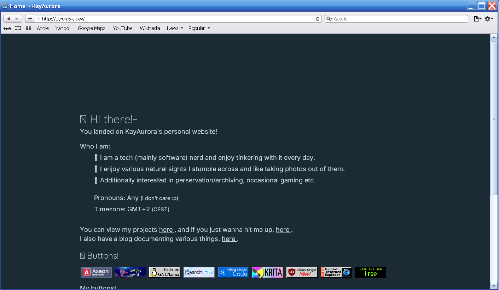

For quite a while now ([that is, since April 2024](/lynxblog/2024/04/25/whats-new-on-lynxmic-website-blog.html)), I've been considering a more retro/Web 1.0-style version of my website. Later on the plans evolved into using a WYSIWYG <small>(What You See Is What You Get)</small> site builder (specifically **Microsoft FrontPage 2003**), as one of the people I know did, which I've actually proceeded to do.

I however later on realized this would mean maintaining two separate websites, that if something was gonna change (e.g. social media handle, new projects etc.) I would have to separately change them, which means extra unnecessary time! And said Retro Frontend wasn't gonna be maintained as much as the main ClyronWebsite, to put it simple.\
If I also added a blog to the "Retro Frontend", that would also mean that this blog post will - once it is out on the ClyronWebsite - also have to be separately adapted for the Retro Frontend.

***So I gave up entirely on FrontPage***, and my new plan became building a kind of a ""Retro Frontend"" on top of ClyronWebsite instead. Thus, everything updates when needed, regardless if the browser is new or old.

> *From this point on, I will refer to **ClyronWebsite** as "this website".*

# Phase 1: Internet Explorer 11
We're gonna start simple, with IE11.\
*Where to start, though?* This website, in particular v2.x versions, has been using **Tailwind CSS**.

Tailwind is a CSS framework. Unlike others like Bulma or Bootstrap, all Tailwind provided were some CSS classes in order to basically make it easier to build a website's design, *and that's what it did*. For starters it's pretty good.\
However, Tailwind uses CSS code that only modern browsers support, which is a blocker to supporting older/ancient browsers at all.

***As such I decided to drop Tailwind CSS to start with***, translating all Tailwind CSS previously used by this website into pure CSS defined in the already-existing `style.css` file. <small>(And this is how v3.0 of this website [came to life](/cl), with a general redesign to go alongside it that I'm pretty satisfied with! ^^)</small>\
As such, *I now basically have full control over the CSS for the first time since the v1.x era of this website*.

From there on, getting the website to work with IE11 wasn't the hardest task at all. However even without Tailwind, this website was still using CSS code that IE11 doesn't support at all, so I had to set up some fallbacks, but nothing too radical.

Along the way I've learned of the **CSS `@supports` rule** - *that's gonna be of major help that will make things waaay easier!*\
Basically you put "by default" fallback code, then using the `@supports` rule you can then write code to be used in modern browsers in curly brackets, where there is actual support for the certain CSS that the website "normally" uses.\
Just to get a better idea, an example CSS structure would be this:

```css
html { /* "Default" CSS code. This will be used by older browsers, which do not support @supports */
    background-color: #000000;
    font-size: 16px; /* Older browsers don't support the rem unit, so we use px */
}
@supports (display: flex) { /* The following code will be used by modern browsers. */
html {
    font-size: 1rem; /* 16px = 1rem */
}
}
```
Important to keep in mind is that the `@supports` rule has been only available across browsers [since 2015](https://developer.mozilla.org/en-US/docs/Web/CSS/@supports). It is not supported by any version of Internet Explorer, or just any older browser for the matter.

So as of right now this website **loads on IE11 well enough** to say. 

 // TODO: use absolute url

There are several issues that still need to be addressed like the whole "click to copy 88x31 HTML code to clipboard thing" not working or the footer and webrings not being properly centered (which can be attributed to IE11's flexbox support being pretty "ehhy")

And yes, you're totally right, what you have actually seen is Internet Explorer 11 in Windows 11. Normally trying to run `iexplore` is supposed to open Edge, but even in the latest 24H2 there's still a loophole you can still use to open IE11, namely by going to *Control Panel -> Internet Options -> Programs tab -> Manage add-ons -> Learn more about toolbars and extensions*. Saved me some potential extra time of having to set up a separate Windows VM and all that stuff.

# Phase 2: IE 7-10, Safari for Windows, Opera Presto
So on to the next phase of bringing this website to work on ancient browsers!\
**Our target now are basically all browsers from 2007-2012** <small>(13-18 years ago!)</small>

For this phase I decided to set up a VM with Windows XP *MCE 2005* <small>(I usually do Professional but decided to try something different)</small>, which came with Internet Explorer 7 out of the box. Here's v3.0 of this website on IE7:


I was expecting something better. Even worse, between the "*Hi there!~*" and the navbar there is a singular weird shape (which is actually a partial star). I was able to easily get this issue addressed (at least for IE) by moving the CSS code associated with the stars in the navbar inside a `@supports`.

Now I've already talked about the fact support for the `rem` unit is more newly-introduced than that of the `px` unit. Well, about other core aspects of the website, the logo & text sizing issues were due to the use of `rem`.

What I've done about it? Put all `rem` sizes inside `@supports` and switch the "main" sizes to `px`. Now I could have just switched it all to `px` but I was simply too lazy to convert all `rem` to `px` while making sure there aren't any differences afterwards. For the background, setting a separate `background-color` fallback fixed it.

**I've also tested this website on Opera Presto and Safari for Windows.** Presto appears to render everything mostly fine at this point, except for a floating star and the logo being abnormally big.\
I've already fixed the star issue for IE as said earlier, but for some reason Presto is just a pain to deal with when it comes to this, as I've tried numerous CSS fixes with no effect :<

Meanwhile on Safari, we have what I'd definitely call "the most cursed thing I have ever seen as a webdev": the lack of navbar. Like, *where did it go?!?!?*



Now maybe maaayybeeee it might not have been the "most cursed thing" after all. The problem here was that the animation just wasn't playing in Safari, to put it in simple words. So the whole navbar was stuck at zero opacity. I moved all CSS code associated with the navbar's animations inside a `@supports` and that fixed it!\
Of course there were other issues (like links or blog tags not displaying properly) but like with other aspects of the site, I've also resorted to fallbacks here as well <small>(the power of `@supports` frfr)</small>

Another issue was that images in blog posts did not load at all. For some reason, Astro <small>(in particular the v5.x versions this website uses)</small> tends to """optimize images""" and convert them to **WebP**, a file format only supported by modern browsers. Unfortunately the best workaround I could find here was switching to absolute URLs.

***The final step was to essentially ditch Flexbox and Grid entirely***. Support for them in older browsers is either hit-or-miss or absent entirely, so I've switched the navbar, footer etc to use `display: block` and `text-align: center` instead, in order for them to stay centered regardless if the browser used is ancient or not.

Aaaand there you have it. A website **that works on browsers as old as IE7, Opera Presto and Safari on Windows**.


As you can see I also decided to try monospaced fonts as a fallback if the default font(s) do not load. I am not sure-sure if I like it or not, but at this point *I have more ambitious ideas in mind, which I'm however leaving for until the right time comes :p*.

# Phase 3: IE 5-6
*We're definitely going retro with this one!!~*\
As the section's title reads, our next target are **browsers from the late 90s/early 2000s**.

For this phase I will be using a Windows 2000 VM. I've first tried the site on IE5. It loads, everything is generally displayed properly (thanks to fallbacks set in the prev phase), but with caveats:
- **Background is white instead of blue**
    - Usually it should fallback to `background-color`, knowing the gradient seen in the navbar in modern browsers *does not even load* in IE11, let alone IE5. However it.. just doesn't.
    - To fix this, the CSS code for the gradient seen in the navbar in modern browsers had to be moved inside a `@supports`
- The logo is **displayed as a square**
    - The logo is a .PNG file, support for which was **only added in IE4**. Even then, proper support for transparent PNGs only came in IE7.
    - Alternatives here are either a static GIF or just a text fallback.
- Images **overflow in the blog**
    - To be properly scaled, they use the `max-width` property, only supported from IE7 onwards.
    - No good alternative exists aside from manually resizing images.

***We basically just reached a limit of how low we can go just by adapting the normal website CSS layout.***\
Now I previously said at the end of the previous section that "*I have more ambitious ideas in mind, which I'm however leaving for until the right time comes :p*".\
Well, *it looks like the right time is basically now*.

## Building a proper "Retro Frontend"
Sooooo we were able to get the website fully working all the way down to IE5 (IE7 if we do not count the logo issue), now we're going to build an actual Retro Frontend *that actually looks retro, if you will* that will load on... basically any old browser predating `@supports`\
<small>(just to keep things simple, since at the end of the day I am not like a full-stack webdev to know everything, this is all for fun :3)</small>

The current website layout is well suited as it's mostly text, as opposed to cards being an main element of the website design in v2.x. The only main exception is the blog index page.

### Actually building it
To start with, I went to look up for a good background image for a 90s website. So the first thing I did was google "*good backgrounds for retro website*". However that turned out to be the best example of Google not giving relevant search results that I could get.\
Most of the search results were """retro backgrounds""" sourced from stock image providers that have literally have nothing to do with what I'm searching for! And y'know what's the most hilarious part? The "People also search for" checkbox:


Yes Google you can be sure if I search for 90s site backgrounds, I also search for AI Image Editing tools. Two things from two different internet eras...\
Jokes aside, in the end I found [GifCities](https://gifcities.org/) *from Internet Archive themselves* where I was finally able to find exactly what I was looking for~

And so now I'll seriously start, stripping any unnecessary code from `style.css` and moving them under `@supports` to be used only by modern browsers and then "forcing" the fallback CSS to display by commenting out all `@supports`. Then did several basic-ish refinements to differentiate the Retro and Modern frontens.

### Let's test!
So I've pushed the Retro Frontend work to GitHub as a beta of v3.1 of this website, then tested it across the different browsers.\
My main observation following this is that Opera Presto (at least later versions of it) *does* actually support the CSS `@supports` rule, which explains the floating star issue that I've previously mentioned <small>(which safe to say I've got a headache trying to fix it)</small> - *I wish I knew earlier*.\
I was able to finally hide the stars in Presto now knowing what's actually going on.

Anyway, now that we have a Retro Frontend, that now ensures support for browsers as old as IE5!\
So, as a matter of fact, ***it is now possible to access this website on OSes as old as Windows 95!*** <small>(an almost 30-year-old OS!)</small>


It is actually super duper amazing that I managed to go down this far while not affecting the "modern frontend" *that much* and I honestly cannot wait to get this out (of "beta") :D

# Even further down?
For the sake of it I decided to test this website on even older browsers. **Unfortunately, CSS support in them is either hit-or-miss or non-existant at all**

**Internet Explorer 4 does render this website well**, albeit with quirks. Particularily from my testing there are parts of the modern frontend leaking or even replacing those of the Retro Frontend. Thankfully the code can be adapted to somewhat fix IE4.

Meanwhile I've also tested the website on **Netscape 4**, however it won't work with the website's CSS *at all*. The output is no different than if I just deleted or renamed `style.css` within my file manager then start the Astro dev server and preview the site locally on my modern browser\
Same goes for basically any browser that lacks CSS support entirely, such as earlier versions of IE and Netscape etc. *Not the end of the world though*, we can adapt the HTML!


So there you have it, a **Plaintext Mode**. In theory this website should now be able to display almost-if-not-fully properly on every *graphical* web browser.\
The only differences between this and the CSS Retro Frontend are the lack of a website background and lack of proper padding in some areas, *which are not really that big of a deal*.

# Conclusion
And there you have it, the answer to "*How low can you go with your site's browser compatibility*", as the title literally says. Of course at the end of the day that depends on each website, but the way this website was thrown up together allowed for this whole ancient browser support thing without the need for any radical changes..

This has been a work in progress for a whole week, having started working on it immediatelly after I pushed the final v3.0 of this website.\
This was pretty fun, what's for sure though is that around the IE4 mark it started to be quite a bit """demotivating""" with all the issues and quirks, and literally testing all those various fixes with trial-and-error. Either way my goals are accomplished, just as I planned, and I can finally move on to other stuff!~

